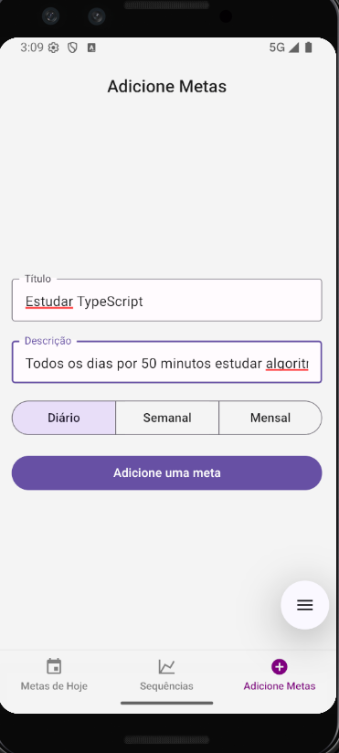

# 🚀 DevStreak — Metas & Hábitos (React Native + Expo + Appwrite)

> **Trabalho da disciplina _Projeto de Software_ (graduação).**  
> Aplicativo mobile para criar e acompanhar **metas/hábitos** com autenticação e dados em nuvem (Appwrite).  
> Foco em código limpo, tipagem com **TypeScript** e UX simples usando **React Native Paper**.

---

## 🎯 Visão Geral

O **DevTracker** ajuda você a criar metas, definir frequência (diária/semanal/mensal) e acompanhar o progresso ao longo do tempo.  
A autenticação é feita pelo **Appwrite**, e os dados ficam salvos no **Database** do Appwrite Cloud.

- 📲 **Mobile** (Expo/React Native)
- 🔐 **Login / Logout** com sessão segura (logout estável via **JWT**)
- ☁️ **Persistência** no Appwrite (Database + Auth)
- 🧭 **Navegação** com Expo Router
- 🧩 **TypeScript** com modelos tipados de documento

---

## 📸 Screenshots

  
  
  

---

## ✨ Principais Funcionalidades

- ✅ **Cadastro & Login** (Appwrite Auth)
- ✅ **Criação de metas** com título, descrição e frequência
- ✅ **Listagem filtrada por usuário**
- ✅ **Sessões persistentes**
- ✅ **Logout confiável em React Native (via JWT + REST)**
- ✅ UI com **React Native Paper**

---

## 🛠️ Stack

- **React Native (Expo)**
- **TypeScript**
- **Expo Router**
- **React Native Paper**
- **Appwrite (Auth + Database)**

